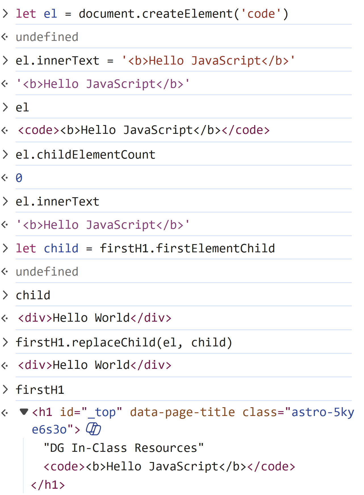

# DOM API

Key to anything that you do in web development is to have a clear distinction between the HTML markup that we typically first encounter and the actual "stuff" that the browser creates based on that markup.

HTML offers us **tags** and **attributes** as a way to declaratively describe the content of the web page. Additionally, a couple of the tags in HTML allow us to "switch" to alternate languages:

- `<style>` tag allows us to enclose CSS inside our HTML
- `<script>` tag allows us to enclose JavaScript inside our HTML

Every tag in our HTML is an instruction to the browser of what *object* to make and put in the Document Object Model (DOM). The DOM is a tree-like structure where the root `<html>` element is the "starting point". That `<html>` element has only two "child" tags/elements: the `<head>`, which contains "meta-data" about the web page, and the `<body>` which holds the content to be displayed to the user.

How does the browser make sense of all the tags and attributes and text inside an HTML file that it's retrieved? Under the hood, the browser has an *engine* that processes the HTML and works to ***render*** the content. At the heart of that rendering is the DOM.

## Nodes vs. Elements

In the tree-like structure of the DOM, we need to understand how there are different "nodes" that make up the tree:

- Tags are created as Nodes that are based on the `HTMLElement` class.
- Attributes are another type of Node that is associated with (is a child of) `HTMLElement` objects.
- The text that is enclosed in our tags (e.g.: `
This is important
`) is also considered a Node and as a child/children of `HTMLElement` objects.

Browser engines have a portion/part that is dedicated to working with JavaScript. The browser developers have leveraged the aspects of JavaScript alongside their needs to represent the DOM as a set of objects they can render/interact with.

Let's explore in the browser dev tools for [this website](https://dg-inclass.github.io/)

While there are literally hundreds of properties and methods for all the types of HTML Elements, here are a few that are of particular interest to us.

- [x] `.childElementCount` - The number of `HTMLElement` objects as the immediate children
- [x] `.nextElementSibling` - The DOM element immediately after
- [x] `.previousElementSibling` - The DOM element immediately before
- [x] `document.createElement()` - Used to generate a new HTML Element as a **document fragement** (i.e.: an element not attached to the DOM)
- [x] `document.createTextNode()` - Used to generate a `TextNode` object with some text inside
- [ ] `.setAttribute()`
- [ ] `.getAttribute()`
- [x] `.appendChild()` - Add/attach a new element/node to an existing HTMLElement
- [x] `.parentElement` - The DOM element that is the immediate parent
- [ ] `.children`
- [ ] `.lastElementChild`
- [ ] `.firstElementChild`
- [x] `.removeChild()` - "Detach"/remove a child from the DOM
- [x] `.replaceChild()` - Put a new element/child in place of an existing child

----

